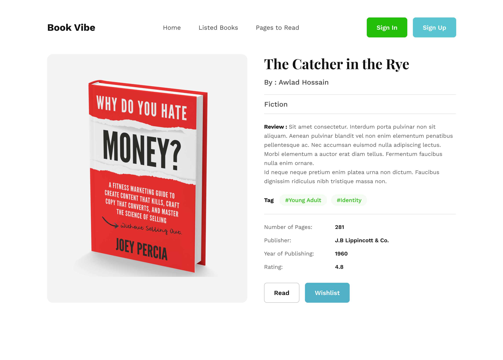
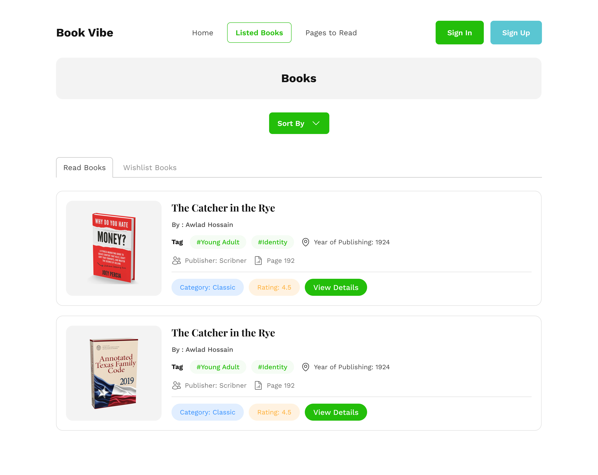
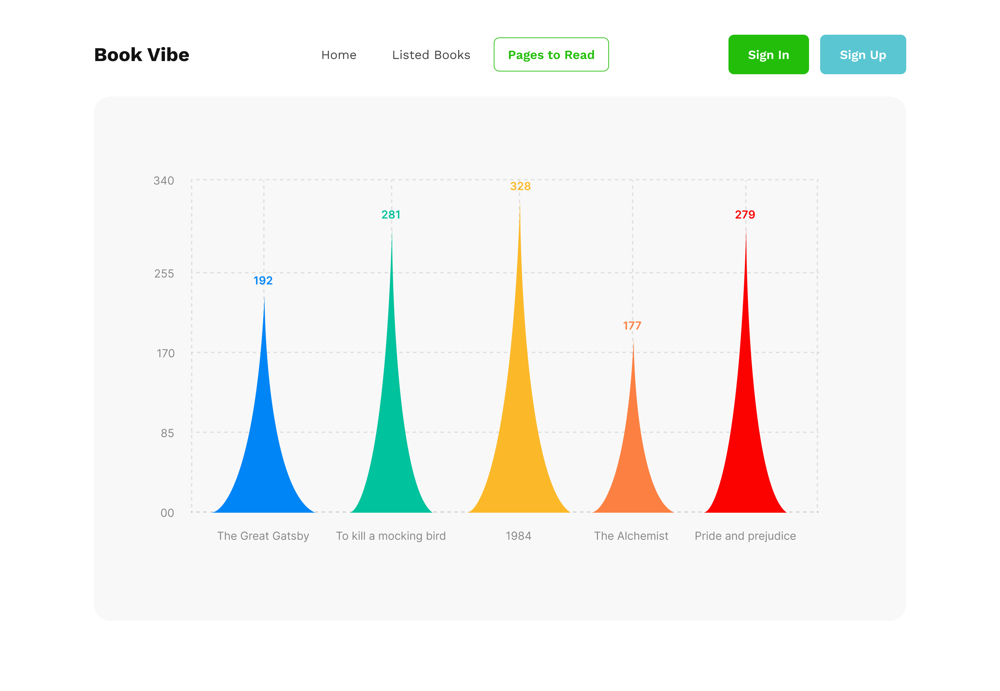

# Book Vibe


## Overview

Book Vibe is a React application. It is built using modern React practices, including functional components and dynamic routes.

## Design 





## Features

- Dynamic
- Add to read list
- Add to wish list
- Chart for completed books
- Responsive design

## Tech Stack

- React.js
- React Router
- Tailwind CSS
- DaisyUI

## Installation

To get started with the project, follow these steps:

```sh
# Clone the repository
git clone https://github.com/mdsaifurrahman117/Book-Vibe.git

# Navigate into the project directory
cd Book-Vibe

# Install dependencies
npm install

# Start the development server
npm run dev
```

## Available Scripts

In the project directory, you can run:

#### `npm run dev`

Runs the app in development mode.

#### `npm test`

Launches the test runner.

#### `npm run build`

Builds the app for production.

#### `npm run deploy`

Deploy for production.

## Project Structure

```
Book-Vibe/
│── public/               # Static assets (assets, design, icons, etc.)
│   ├── assets/ 
│   │   ├── design        # Application design
│   │   │   ├── Book Details.jpg
│   │   │   ├── Filter Page.jpg
│   │   │   ├── Landing Page Design.jpg
│   │   │   └── Meter.jpg
│   │   └── book.ico   # Favicon
│   └── booksData.json    # Application data
│
│── src/                  # Main source code
│   ├── assets/           # Static assets like images, etc.
│   │   └── books.jpg
│   ├── components/       # Reusable components
│   │   ├── books/            # Book components
│   │   │   ├── Book_detail.jsx
│   │   │   ├── Book.jsx
│   │   │   └── Books.jsx
│   │   ├── Button.jsx
│   │   ├── Footer.jsx
│   │   ├── Header.jsx
│   │   └── Hero.jsx
│   ├── layout/           # Page layout
│   │   └── Root.jsx      # Root element
│   ├── pages/            # Page components (Error page, Listed page, Reading meter etc.)
│   │   ├── Error_page.jsx
│   │   ├── Listed_books.jsx
│   │   └── Reading_meter.jsx
│   ├── utility/          # Utility functions/helpers
│   │   ├── add_to_storage.js
│   │   └── add_to_wish_list.js
│   ├── App.jsx           # Root component
│   ├── index.css         # Style element (Tailwind CSS, CSS, Fonts, etc)
│   └── main.jsx          # Main entry point
│
│── .gitignore            # Git ignore file
│── eslint.config.js      # ESLint config file
│── index.html            # Index html file
│── package-lock.json     # Node package manager
│── package.json          # Dependencies and scripts
│── README.md             # Documentation
└── vite.config.js        # Vite configuration (if using Vite)
```

## Deployment

This project can be deployed using:

- GitHub Pages : https://mdsaifurrahman117.github.io/Book-Vibe/

To deploy with Vercel:

```sh
npm install -g vercel
vercel
```

To deploy with GitHub pages:

```sh
npm install gh-pages
npm run build
npm run deploy
```

## Contributing

Contributions are welcome! Feel free to fork the repository and submit a pull request.

## Contact

For questions or issues, please reach out to [[saifurrahmansaif954@gmail.com](mailto\:saifurrahmansaif954@gmail.com)] or open an issue in the repository.


